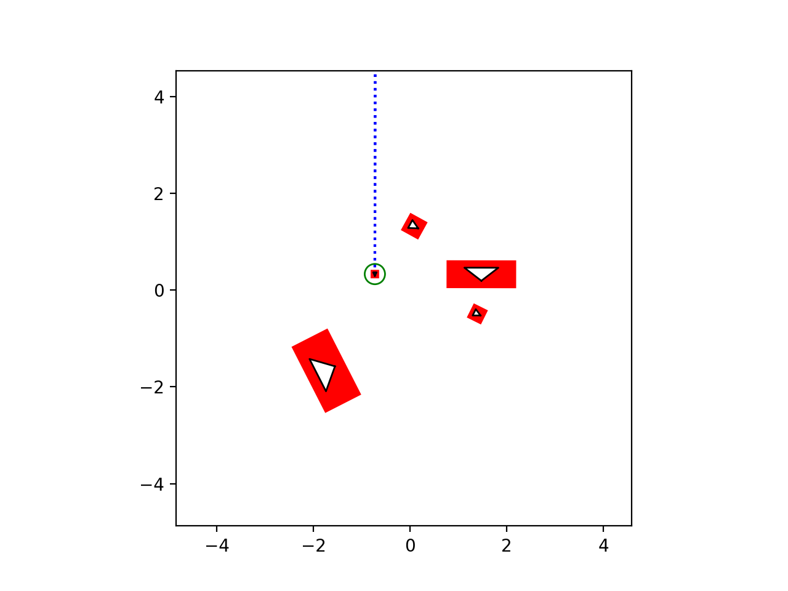
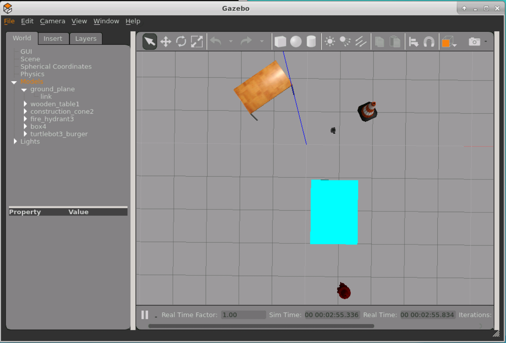

## GzScenic

This tool allows you to create static worlds for Gazebo using
[Scenic](https://scenic-lang.readthedocs.io/en/latest/quickstart.html) language.
As an input, `gzscenic` expects a description of the models used in the scenarios,
and a scenario written in Scenic language. GzScenic outputs a plot of the scene
generated from the described scenario and a set of gazebo models
and a world descriptor that can be used by Gazebo to recreate the scene.


### How to install

GzScenic requires Python 3.8 or newer. We encourage using virtual environments.
Using [pipenv](https://pipenv-fork.readthedocs.io/en/latest/) you can create such
environment by running:
```
$ pipenv shell
```
To install `gzscenic` simply run:
```
$ pip install .
```

### How to run

`gzscenic` accepts three mandatory arguments and many optionals. You can get a full
list of the arguments using `gzscenic -h`.
```
$ gzscenic <scenario input> <model description input> <path to output directory>
```

Scenario Input
--------------

The scenario input file is a `.scenic` file written in the Scenic language, which
describes the scenario you are interested in generating. The models you use in this
scenario file are described in the `<model description input>`, and imported using
`from gzscenic.model import *`. You can find a simple example of such scenario
in [example/scenarios](example/scenarios) directory.


Model Description Input
-----------------------

GzScenic needs to build classes for models that are used in scenarios in order to
be able to properly interpret them. As a result it expects a YAML file that provides
information about the used models and the initial world environment.

The YAML file should have the following format:
```
world: <path to an empty gazebo world file>
models_dir: <path to a directory holding custom models (default: same directory as where this input file is stored)>
models:
  - name: <name of the model>
    type: <type of the model: MISSION_ONLY, CUSTOM_MODEL, GAZEBO_MODEL>
  - name: <..>
    type: <..>
```

GzScenic's goal is to arrange the objects in the environment as described by the
scenario input file. As a result it expects a world description (e.g., `.world` or
`.sdf` format) that is usually referred to as `empty_world`; a world that is empty of
objects but includes the desired settings for light and the ground plane.

There are three types of models that GzScenic can handle:
1. GAZEBO\_MODEL: these are standard Gazebo models listed [here](https://github.com/osrf/gazebo_models). GzScenic automatically determines the size of these models and
creates the specified objects. You can optionally specify if you would like the
objects of these models to keep their original size or be able to scale up and down
whenever possible by setting `dynamic_size` to `True` or `False`.
2. CUSTOM\_MODEL: these are models that are either custom made by you, or need to
be downloaded from a source other than Gazebo models. In the former case, GzScenic
will look for a directory with the same name as this model in the `models_dir`. This
directory should include a `model.sdf` file that describes this custom model, and all
necessary mesh files if the exist. In the later case, GzScenic will download the
model from the `url` specified in the YAML file.
3. NO\_MODEL: these models describe objects that are described in the scenario, but
should not be included in the final worl model. For example, using the scenario
you can specify waypoints that are of interest to you. However, waypoints cannot
be described in the world model. Instead, GzScenic outputs a list of
the position and heading information of the objects with no models. Since GzScenic
cannot automatically learn information about the size of these NO\_MODEL object,
it expects `length` and `width` of the model to be provided in the YAML file.

There are a number of optional information you can provide for each model:
- `z`: since Scenic only operates in 2D, GzScenic sets the `z` coordinate of all
objects to zero. However, you can optionaly set that to a different value for each
model.
- `heading`: by default the heading of object are determined randomly or as specified
by the scenario. If you want the object to always have a fixed heading you can use
this attribute.
- `dynamic_size`: GzScenic automatically determines whether an objoct can have dynamic
size or its size should be fixed. If you want to rewrite that you can explicitely specify.

A full example of this YAML file and accompanying files are provided in [example/input](example/input). Pay attention that paths provided in the YAML file are relative to
where the file is stored.


Path to Output Directory
------------------------

GzScenic outputs a `.world` file that describes the scene generated and ploted,
a set of models in the `models` directory, and a list of positions for objects
of NO\_MODEL type `poses.yaml`.


### Example

The [example](example/) directory includes a simple example of creating scenes for
Turtlebot3. By running the following command you can recreate these scenes:
```
$ gzscenic example/scenarios/test.scenic example/input/objects.yml example/out/test
```

Here is the plot generated by GzScenic for this scenario:


Here is how the scene looks like when launched by Gazebo:


##### Useful links

- [Scenic documentation](https://scenic-lang.readthedocs.io/en/latest/quickstart.html#)
- [SDF Format](http://sdformat.org/spec)
- [Gazebo model format](http://gazebosim.org/tutorials/?tut=build_robot)
